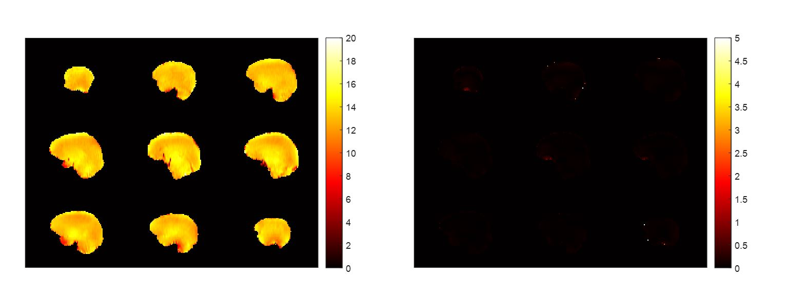

# pTx-SPSP
This is a matlab toolbox for designing parallel transmit (pTx) spatial spectral (SPSP) RF pulses for high and ultra-high field MRI.
You may run the demo script, `demo.m`, to grab an idea of how this toolbox can be used to design pTx SPSP pulses to create robust uniform water-selective excitation across the entire human brain at 7 Tesla. 
Our pulse design algorithm involves two-step optimization, with the optimization in step 1 relying on the CMA-ES (Covariance Matrix Adaptation Evolution Strategy) and being achieved using the code generously shared at https://cma-es.github.io/. 

If you use the toolbox, please consider citing the following paper:

Xin Shao, Zhe Zhang, Xiaodong Ma, Fan Liu, Hua Guo, Kamil Ugurbil, Xiaoping Wu. Parallel transmission spatial spectral pulse design with local specific absorption rate control: demonstration for robust uniform water-selective excitation in the human brain at 7 Tesla. In press. DOI: 10.1002/mrm.30346


### Copyright & License Notice
This software is copyrighted by the Regents of the University of Minnesota. It can be freely used for educational and research purposes by non-profit institutions and US government agencies only. 
Other organizations are allowed to use this software only for evaluation purposes, and any further uses will require prior approval. The software may not be sold or redistributed without prior approval. 
One may make copies of the software for their use provided that the copies, are not sold or distributed, are used under the same terms and conditions. 
As unestablished research software, this code is provided on an "as is'' basis without warranty of any kind, either expressed or implied. 
The downloading, or executing any part of this software constitutes an implicit agreement to these terms. These terms and conditions are subject to change at any time without prior notice.

### About the demo

Set up training list and start your pTx-SPSP pulse design

```matlab
trainID = [1]; %%% serial number of calibration
%%% Tips: put more than one number here for universal pulse training;
%%% The universal pulse calculation is still under development for this open-source version right now.
RF_duration = 2.88e-3; %%% duration of the RF pulse, can not be changed the this version
dt = 10e-6; %%% dwell time, s, can not be changed in the demo
TR = 50e-3; %%% repetition time, s, used in SAR-constraint.
RFA = round(ernstAngle(TR)); %%% round: the vendor-provided FA is integer
[rf,grad,localSAR] = design_pTxSPSP_RF(trainID,RF_duration,dt,TR,RFA,'SPINS');
```

You can use showPulse() to check the designed RF and Grad.

```matlab
showPulse(rf,grad,RF_duration,dt);
```


```matlab
offset = -100;%%% To see the robustness to off-resonance
%%% As in the paper, you may change offset to 0 and ±100
showPerform(ID,rf,grad,dt, offset,RFA);
```

And use showPerform() to reproduce the water-excitation results. Shown are uniform water-excitation (left) and robust fat-suppression (right) at a -100Hz offset.



For further validation, use showFrequencyRes() to see the amazing frequency-responce curve!

```matlab
showFrequencyRes(ID,rf,grad,dt,RFA);
```


